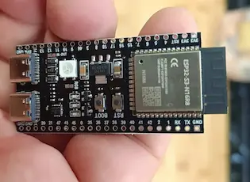
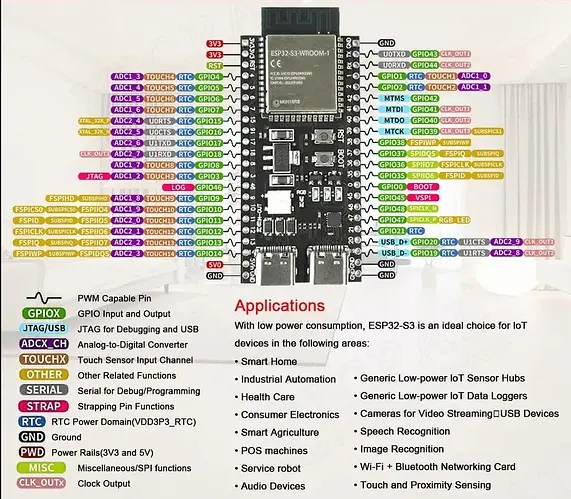

# Curso: "Programa el Mundo Real con Vibe Coding y ESP32"



## Introducción

¡Bienvenido al curso "Programa el Mundo Real con Vibe Coding y ESP32"! En este curso, exploraremos el emocionante mundo de la programación de microcontroladores y el Internet de las Cosas (IoT) de una manera innovadora y accesible para todas las edades.

Olvídate de las complejidades iniciales de la sintaxis. Aquí, aprenderás a "programar con la mente" utilizando el concepto de **Vibe Coding**. Esto significa que te enfocarás en *qué quieres que haga tu dispositivo* y usarás un asistente de inteligencia artificial (como Gemini) para ayudarte a generar el código necesario. Luego, cargarás ese código en tu placa [**ESP32-S3-N16R8**](https://es.aliexpress.com/item/1005006418608267.html) para ver tus ideas cobrar vida en el mundo físico.

La placa ESP32-S3-N16R8 es un potente microcontrolador con capacidades Wi-Fi y Bluetooth, lo que la convierte en la herramienta perfecta para construir proyectos interactivos y conectados.

## Objetivos del Curso

Al finalizar este curso, serás capaz de:

1.  **Comprender los fundamentos del "Vibe Coding"** y cómo utilizar asistentes de IA para generar código.
2.  **Familiarizarte con la placa ESP32-S3-N16R8**, sus componentes principales y cómo interactuar con ella.
3.  **Configurar tu entorno de desarrollo** para programar la ESP32.
4.  **Programar la ESP32** para interactuar con componentes electrónicos básicos como LEDs y botones.
5.  **Leer datos de sensores** y utilizarlos para tomar decisiones en tus programas.
6.  **Conectar tu ESP32 a redes Wi-Fi** y crear tus propios servidores web sencillos.
7.  **Desarrollar un proyecto final** que integre varios conceptos aprendidos, demostrando tu capacidad para "programar el mundo real".

¡Prepárate para transformar tus ideas en realidad con la magia del Vibe Coding y la potencia de la ESP32!

## Módulo 0: Preparando el Terreno

Antes de sumergirnos en la programación, nos aseguraremos de que tienes todo lo necesario para empezar:

*   **¿Qué es "Vibe Coding"?** Una explicación detallada de cómo usaremos esta metodología.
    
    El "Vibe Coding" es una forma intuitiva de programar donde te enfocas en la **intención** y el **resultado** deseado, en lugar de en la sintaxis exacta del código. En este curso, tu asistente de IA (como Gemini) será tu copiloto de programación. Así es como lo haremos:

    1.  **Define tu Objetivo:** Piensa en lo que quieres que tu ESP32 haga. Por ejemplo: "Quiero que el LED parpadee" o "Necesito leer la temperatura de un sensor".
    2.  **Formula tu "Prompt":** Traduce tu objetivo a una pregunta o instrucción clara para el asistente de IA. Sé específico sobre la placa (ESP32-S3-N16R8) y el lenguaje (Arduino/C++).
        *   **Ejemplo de Prompt:** "Escribe un código en Arduino para la ESP32-S3-N16R8 que haga parpadear el LED integrado cada 500 milisegundos."
    3.  **Genera el Código:** El asistente de IA te proporcionará un fragmento de código basado en tu prompt.
    4.  **Revisa y Adapta:** Lee el código generado. Aunque la IA es muy buena, siempre es importante entender lo que hace y, si es necesario, hacer pequeños ajustes. ¡Esta es una parte crucial del aprendizaje!
    5.  **Carga y Prueba:** Copia el código en el IDE de Arduino, cárgalo a tu ESP32 y observa cómo funciona en el mundo real.

    Este método te permitirá experimentar rápidamente, entender los conceptos subyacentes y construir proyectos sin la frustración inicial de recordar cada coma o punto y coma.
*   **¿Qué es el Internet de las Cosas (IoT)?**
    
    El **Internet de las Cosas (IoT)** se refiere a la red de objetos físicos ("cosas") que llevan sensores, software y otras tecnologías para conectarse e intercambiar datos con otros dispositivos y sistemas a través de internet. Piensa en ello como darle superpoderes digitales a los objetos cotidianos.

    *   **Ejemplos de IoT:**
        *   Un termostato inteligente que puedes controlar con tu teléfono desde cualquier lugar.
        *   Zapatillas para correr que registran la distancia y la velocidad de tus carreras.
        *   Sensores en una granja que miden la humedad del suelo y activan el riego automáticamente.

    **¿Por qué es importante para este curso?**
    La placa **ESP32-S3-N16R8** es una estrella en el mundo del IoT. Gracias a su conectividad **Wi-Fi y Bluetooth incorporada**, es la herramienta perfecta para crear tus propios dispositivos IoT. En este curso, no solo aprenderás a leer sensores y controlar LEDs, sino que también darás el salto para conectar tus creaciones a la red. Podrás, por ejemplo, crear una pequeña estación meteorológica que publique la temperatura en una página web o un sistema que te envíe una notificación a tu teléfono cuando alguien presione un botón. ¡El IoT es donde el mundo físico y el digital se encuentran, y tú estarás justo en el centro de esa intersección!
*   **Conociendo tu Placa:** Un recorrido por las características y pines de la ESP32-S3-N16R8.
    
    La **ESP32-S3-N16R8** es un microcontrolador muy versátil y potente, ideal para proyectos de IoT y embebidos. Aquí te presentamos sus características clave:

    *   **Microcontrolador:** ESP32-S3 de Espressif, con doble núcleo Xtensa LX7, optimizado para aplicaciones de IA y IoT.
    *   **Conectividad:** Wi-Fi 2.4 GHz (802.11 b/g/n) y Bluetooth 5 (LE). Esto permite que tu placa se comunique con otros dispositivos y se conecte a internet.
    *   **Memoria:**
        *   **Flash:** 16 MB (N16) para almacenar tus programas y datos.
        *   **PSRAM:** 8 MB (R8) de RAM externa para aplicaciones que requieren más memoria.
    *   **Periféricos:** Una gran cantidad de pines de Entrada/Salida de Propósito General (GPIOs) que pueden configurarse para diversas funciones:
        *   **ADC (Convertidor Analógico-Digital):** Para leer sensores analógicos (temperatura, luz, etc.).
        *   **DAC (Convertidor Digital-Analógico):** Para generar señales analógicas.
        *   **I2C, SPI, UART:** Para comunicarse con otros módulos y sensores.
        *   **PWM (Modulación por Ancho de Pulso):** Para controlar la intensidad de LEDs o la velocidad de motores.
    *   **USB-C:** Generalmente utilizada para alimentación, programación y comunicación serie.

    **¿Dónde encontrar el Pinout?**
    Es crucial tener a mano el diagrama de pines (pinout) de tu placa ESP32-S3-N16R8. Este diagrama te mostrará qué función tiene cada pin y cómo conectar tus componentes externos. Puedes encontrarlo buscando en Google "ESP32-S3-N16R8 pinout" o consultando la documentación específica del fabricante de tu placa. ¡Guarda una copia, la necesitarás a menudo!

    
*   **Configuración del Entorno:** Guía paso a paso para instalar PlatformIO en VS Code.
    
    Para poder programar tu placa ESP32-S3-N16R8, utilizaremos **PlatformIO IDE** dentro de **Visual Studio Code**. PlatformIO es un ecosistema de desarrollo de código abierto para IoT que ofrece una experiencia de programación más avanzada y flexible.

    Sigue estos pasos:

    1.  **Instalar Visual Studio Code (VS Code):**
        *   Si aún no lo tienes, descarga e instala VS Code desde su sitio web oficial: [https://code.visualstudio.com/](https://code.visualstudio.com/)
        *   Sigue las instrucciones de instalación para tu sistema operativo.

    2.  **Instalar la Extensión PlatformIO IDE:**
        *   Abre VS Code.
        *   Ve a la vista de Extensiones (icono de cuadrados en la barra lateral izquierda o `Ctrl+Shift+X`).
        *   En la barra de búsqueda, escribe "PlatformIO IDE".
        *   Encuentra la extensión "PlatformIO IDE" (normalmente la primera opción) e haz clic en "Instalar".
        *   Una vez instalada, es posible que VS Code te pida reiniciar.

    3.  **Crear un Nuevo Proyecto PlatformIO:**
        *   Después de instalar la extensión, verás un icono de PlatformIO (una cabeza de hormiga) en la barra de actividad de VS Code. Haz clic en él.
        *   En la página de inicio de PlatformIO, haz clic en "New Project".
        *   **Nombre del Proyecto:** Dale un nombre descriptivo a tu proyecto (ej. `MiPrimerESP32`).
        *   **Board (Placa):** Busca y selecciona tu placa. Puedes escribir "ESP32-S3-N16R8" o buscar "ESP32-S3 Dev Module" si tu placa es una variante genérica. Asegúrate de elegir una placa basada en el chip ESP32-S3.
        *   **Framework:** Selecciona "Arduino".
        *   **Location:** Elige una ubicación para tu proyecto. Puedes desmarcar "Use default location" si quieres especificar una carpeta.
        *   Haz clic en "Finish". PlatformIO configurará la estructura del proyecto y descargará las herramientas necesarias.

    4.  **Conectar tu Placa ESP32-S3-N16R8:**
        *   Conecta tu placa ESP32-S3-N16R8 a tu ordenador usando un cable USB-C.
        *   En la parte inferior de VS Code, en la barra de estado de PlatformIO, deberías ver el puerto serie detectado (ej. `COMx` en Windows, `/dev/ttyUSBx` en Linux, `/dev/cu.usbserial-xxxx` en macOS). Si no aparece, asegúrate de que los controladores USB-Serial estén instalados (ver el punto 5 del apartado anterior sobre controladores, si fuera necesario).

    5.  **Estructura Básica del Proyecto PlatformIO:**
        *   Una vez creado el proyecto, verás una estructura de carpetas. El archivo principal donde escribirás tu código será `src/main.cpp`.
        *   El archivo `platformio.ini` contiene la configuración de tu proyecto (placa, framework, librerías, etc.).

    6.  **Compilar y Subir tu Código:**
        *   En la barra de estado de PlatformIO en la parte inferior de VS Code, encontrarás botones para:
            *   **Build (icono de checkmark):** Compila tu código.
            *   **Upload (icono de flecha a la derecha):** Compila y sube el código a tu placa.
            *   **Serial Monitor (icono de enchufe):** Abre el monitor serie para ver la salida de tu placa.

    ¡Con PlatformIO y VS Code, tienes un entorno de desarrollo muy potente y listo para empezar a programar tu ESP32-S3-N16R8!

*   **Instalación de Node.js y Gemini CLI:**
    
    Para aprovechar al máximo el "Vibe Coding" con tu asistente de IA (Gemini), necesitarás instalar Node.js y la herramienta de línea de comandos de Gemini.

    1.  **Instalar Node.js:**
        *   **Windows:** Se recomienda usar `winget` (Administrador de paquetes de Windows). Abre una terminal como administrador y ejecuta:
            ```bash
            winget install OpenJS.NodeJS
            ```
            Si no tienes `winget`, puedes descargarlo desde [nodejs.org](https://nodejs.org/).
        *   **macOS:** Se recomienda usar Homebrew. Abre una terminal y ejecuta:
            ```bash
            brew install node
            ```
        *   **Linux:** Utiliza el gestor de paquetes de tu distribución. Por ejemplo, para Debian/Ubuntu:
            ```bash
            sudo apt update
            sudo apt install nodejs npm
            ```
        Verifica la instalación ejecutando `node -v` y `npm -v`.

    2.  **Instalar Gemini CLI:**
        Una vez que Node.js y npm estén instalados, abre una terminal y ejecuta:
        ```bash
        npm install -g @google/gemini-cli
        ```
        Esto instalará la herramienta de línea de comandos de Gemini globalmente.
        Verifica la instalación ejecutando `gemini -v`.

        Asegúrate de configurar tu clave de API de Gemini siguiendo las instrucciones de la documentación oficial de Gemini CLI.

## [Módulo 1: Primeros Pasos con el LED RGB (NeoPixel)](Modulo%201/README.md)

## [Módulo 2: Fundamentos de Programación Aplicada](Modulo%202/README.md)

## [Módulo 3: Interactuando con el Mundo Físico: Sensores y Entradas](Modulo%203/README.md)

## [Módulo 4: Conectando tu Proyecto al Mundo con Wi-Fi](Modulo%204/README.md)